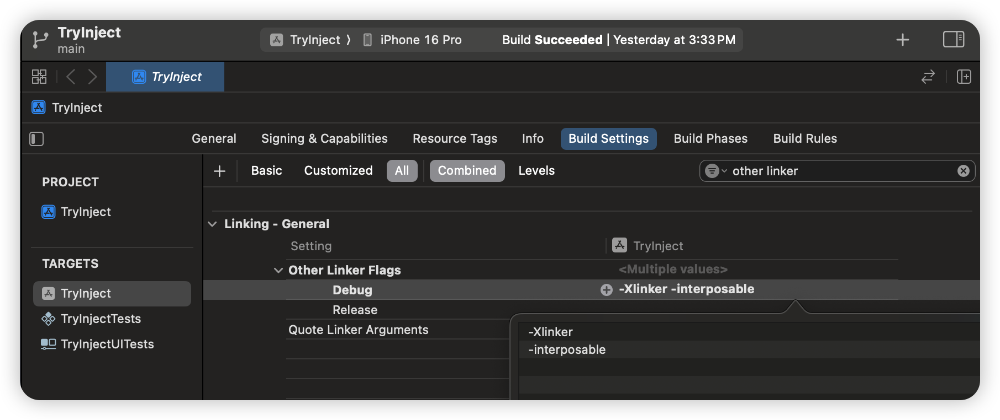

# InjectionIII.app Project

## Yes, HotReloading for Swift 

Chinese language README:  [中文集成指南](https://github.com/johnno1962/InjectionIII/blob/main/README_Chinese.md)


Code injection allows you to update the implementation of functions and any method of a class, struct or enum incrementally in the iOS simulator
without having to perform a full rebuild or restart your application. This saves the developer a significant amount of time tweaking code or iterating over a design. Effectively it changes Xcode from being a
"source editor" to being a _"program editor"_ where source changes are 
not just saved to disk but into your running program directly.

### How to use it

Setting up your projects to use injection is now as simple as downloading
one of the [github
releases](https://github.com/johnno1962/InjectionIII/releases) of the app 
or from the [Mac App Store](https://itunes.apple.com/app/injectioniii/id1380446739?mt=12) 
and adding the code below somewhere in your app to be executed on
startup (it is no longer necessary to actually run the app itself).

```Swift
#if DEBUG
Bundle(path: "/Applications/InjectionIII.app/Contents/Resources/iOSInjection.bundle")?.load()
//for tvOS:
Bundle(path: "/Applications/InjectionIII.app/Contents/Resources/tvOSInjection.bundle")?.load()
//Or for macOS:
Bundle(path: "/Applications/InjectionIII.app/Contents/Resources/macOSInjection.bundle")?.load()
#endif
```
 It's also important to add the options `-Xlinker` and `-interposable` (without double
 quotes and on separate lines) to the "Other Linker Flags" of targets in your project 
(for the `Debug` configuration only) to enable "interposing" (see the explanation below).



After that, when you run your app in the simulator you should see a 
message saying a file watcher has started for your home directory 
and, whenever you save a source file in the current project it should 
report it has been injected. This means all places that formerly 
called the old implementation will have been updated to call the 
latest version of your code.

It's not quite as simple as that as to see results on the screen
immediately the new code needs to have actually been called.
For example, if you inject a view controller it needs to force a
redisplay. To resolve this problem, classes can implement an 
`@objc func injected()` method which will be called after the 
class has been injected to perform any update to the display. 
One technique you can use is to include the following code 
somewhere in your program:

```Swift
#if DEBUG
extension UIViewController {
    @objc func injected() {
        viewDidLoad()
    }
}
#endif
```
Another solution to this problem is "hosting" using the 
[Inject](https://github.com/krzysztofzablocki/Inject)
Swift Package introduced by this 
[blog post](https://merowing.info/2022/04/hot-reloading-in-swift/).

### What injection can't do

You can't inject changes to how data is laid out in memory i.e.
you cannot add, remove or reorder properties with storage. 
For non-final classes this also applies to adding
or removing methods as the `vtable` used for dispatch is 
itself a data structure which must not change over injection.
Injection also can't work out what pieces of code need to
be re-executed to update the display as discussed above.
Finally, Injection doesn't cope well with source files being
added/renamed/deleted during injection. You will need to
build and relaunch your app or even close and reopen
your project to clear out old Xcode build logs.

### Injection of SwiftUI

SwiftUI is, if anything, better suited to injection than UIKit
as it has specific mechanisms to update the display but you need
to make a couple changes to each 	`View` struct you want to inject.
To force redraw the simplest way is to add a property that
observes when an injection has occurred:

```
    @ObserveInjection var forceRedraw
```
This property wrapper is available in either the 
[HotSwiftUI](https://github.com/johnno1962/HotSwiftUI) or
[Inject](https://github.com/krzysztofzablocki/Inject)
Swift Package. It essentially contains an `@Published` 
integer your views observe that increments with each 
injection. You can use one of the following to make one
of these packages available throughout your project:

```
@_exported import HotSwiftUI
or
@_exported import Inject
```
The second change you need to make for reliable SwiftUI
injection is to "erase the return type" of the body property
by wrapping it in `AnyView` using the `.enableInjection()` 
method extending `View` in these packages. This is because, 
as you add or remove SwiftUI elements it can change the concrete 
return type of the body property which amounts to a memory layout 
change that may crash. In summary, the tail end of each body should
always look like this:

```
    var body: some View {
    	 VStack or whatever {
        // Your SwiftUI code...
        }
        .enableInjection()
    }

    @ObserveInjection var redraw
```
You can leave these modifications in your production code as, 
for a `Release` build they optimise out to a no-op.

### Injection on an iOS device

This can work but you will need to actually run one of the [github 
4.8.0+ releases](https://github.com/johnno1962/InjectionIII/releases) 
of the InjectionIII.app, set a user default to opt-in and restart the app.

```
$ defaults write com.johnholdsworth.InjectionIII deviceUnlock any
```
Then, instead of loading the injection bundles run this script in a "Build Phase":

```
RESOURCES=/Applications/InjectionIII.app/Contents/Resources
if [ -f "$RESOURCES/copy_bundle.sh" ]; then
    "$RESOURCES/copy_bundle.sh"
fi
```
and, in your application execute the following code on startup:

```
    #if DEBUG
    if let path = Bundle.main.path(forResource:
            "iOSInjection", ofType: "bundle") ??
        Bundle.main.path(forResource:
            "macOSInjection", ofType: "bundle") {
        Bundle(path: path)!.load()
    }
    #endif
```
Once you have switched to this configuaration it will also
work when using the simulator. Consult the README of the
[HotReloading project](https://github.com/johnno1962/HotReloading) 
for details on how to debug having your program connect to the 
InjectionIII.app over Wi-Fi. You will also need to select the project 
directory for the file watcher manually from the pop-down menu.

### Injection on macOS

It works but you need to temporarily turn off the "app sandbox" and
"library validation" under the "hardened runtime" during development 
so it can dynamically load code.

### How it works

Injection has worked various ways over the years, starting out using 
the "Swizzling" apis for Objective-C but is now largely built around 
a feature of Apple's linker called "interposing" which provides a 
solution for any Swift method or computed property of any type.

When your code calls a function in Swift, it is generally "statically
dispatched", i.e. linked using the "mangled symbol" of the function being called.
Whenever you link your application with the "-interposable" option
however, an additional level of indirection is added where it finds 
the address of all functions being called through a section of 
writable memory. Using the operating system's ability to load 
executable code and the [fishhook](https://github.com/facebook/fishhook) 
library to "rebind" the call it is therefore possible to "interpose"
new implementations of any function and effectively stitch 
them into the rest of your program at runtime. From that point it will 
perform as if the new code had been built into the program. 

Injection uses the `FSEventSteam` api to watch for when a source
file has been changed and scans the last Xcode build log for how to
recompile it and links a dynamic library that can be loaded into your
program. Runtime support for injection then loads the dynamic library 
and scans it for the function definitions it contains which it then
"interposes" into the rest of the program. This isn't the full story as
the dispatch of non-final class methods uses a "vtable" (think C++ 
virtual methods) which also has to be updated but the project looks 
after that along with any legacy Objective-C "swizzling".

If you are interested knowing more about how injection works
the best source is either my book [Swift Secrets](http://books.apple.com/us/book/id1551005489) or the new, start-over reference implementation
in the [InjectionLite](https://github.com/johnno1962/InjectionLite) 
Swift Package. For more information about "interposing" consult [this
blog post](https://www.mikeash.com/pyblog/friday-qa-2012-11-09-dyld-dynamic-linking-on-os-x.html) 
or the README of the [fishhook project](https://github.com/facebook/fishhook). 
For more information about the organisation of the app itself, consult [ROADMAP.md](https://github.com/johnno1962/InjectionIII/blob/main/ROADMAP.md).

### A bit of terminology

Getting injection to work has three components. A FileWatcher, the code to
recompile any changed files and build a dynamic library that can be loaded 
and the injection code itself which stitches the new versions of your code
into the app while it's running. How these three components are combined
gives rise to the number of ways injection can be used.

"Injection classic" is where you download one of the [binary releases](https://github.com/johnno1962/InjectionIII/releases)
from github and run the InjectionIII.app. You then load one of the bundles
inside that app into your program as shown above in the simulator. 
In this configuration, the file watcher and source recompiling is done 
inside the app and the bundle connects to the app using a socket to 
know when a new dynamic library is ready to be loaded.

"App Store injection" This version of the app is sandboxed and while
the file watcher still runs inside the app, the recompiling and loading
is delegated to be performed inside the simulator. This can create 
problems with C header files as the simulator uses a case sensitive 
file system to be a faithful simulation of a real device.

"HotReloading injection" was where you are running your app on a device
and because you cannot load a bundle off your Mac's filesystem on a real 
phone you add the [HotReloading Swift Package](https://github.com/johnno1962/HotReloading)
to your project (during development only!) which contains all the code that
would normally be in the bundle to perform the dynamic loading. This 
requires that you use one of the un-sandboxed binary releases. It has
also been replaced by the `copy_bundle.sh` script described above.

"Standalone injection". This was the most recent evolution of the project 
where you don't run the app itself anymore but simply load one of the 
injection bundles and the file watcher, re-compilation and injection are 
all performed inside the simulator. By default this watches for changes 
to any Swift file inside your home directory though you can change this
using the environment variable `INJECTION_DIRECTORIES`.

All these variations require you to add the "-Xlinker -interposble" linker flags 
for a Debug build or you will only be able to inject non-final methods of classes.

### Further information

Consult the [old README](https://github.com/johnno1962/InjectionIII/blob/main/OLDME.md) which if anything contained 
simply "too much information" including the various environment
variables you can use for customisation. A few examples:

| Environment var. | Purpose |
| ------------- | ------------- |
| **INJECTION_DETAIL** | Verbose output of all actions performed |
| **INJECTION_TRACE** | Log calls to injected functions (v4.6.6+) |
| **INJECTION_HOST** | Mac's IP address for on-device injection |

With an **INJECTION_TRACE** environment variable, injecting 
any file will add logging of all calls to functions and methods in
the file along with their argument values as an aid to debugging.

A little known feature of InjectionIII is that provided you have 
run the tests for your app at some point you can inject an 
individual XCTest class and have if run immediately – 
reporting if it has failed each time you modify it.

### Acknowledgements:

This project includes code from [rentzsch/mach_inject](https://github.com/rentzsch/mach_inject),
[erwanb/MachInjectSample](https://github.com/erwanb/MachInjectSample),
[davedelong/DDHotKey](https://github.com/davedelong/DDHotKey) and
[acj/TimeLapseBuilder-Swift](https://github.com/acj/TimeLapseBuilder-Swift) under their
respective licenses.

The App Tracing functionality uses the [OliverLetterer/imp_implementationForwardingToSelector](https://github.com/OliverLetterer/imp_implementationForwardingToSelector) trampoline implementation via the [SwiftTrace](https://github.com/johnno1962/SwiftTrace) project under an MIT license.

SwiftTrace uses the very handy [https://github.com/facebook/fishhook](https://github.com/facebook/fishhook).
See the project source and header file included in the app bundle
for licensing details.

This release includes a very slightly modified version of the excellent
[canviz](https://code.google.com/p/canviz/) library to render "dot" files
in an HTML canvas which is subject to an MIT license. The changes are to pass
through the ID of the node to the node label tag (line 212), to reverse
the rendering of nodes and the lines linking them (line 406) and to
store edge paths so they can be coloured (line 66 and 303) in "canviz-0.1/canviz.js".

It also includes [CodeMirror](http://codemirror.net/) JavaScript editor
for the code to be evaluated using injection under an MIT license.

The fabulous app icon is thanks to Katya of [pixel-mixer.com](http://pixel-mixer.com/).

$Date: 2024/01/18 $
