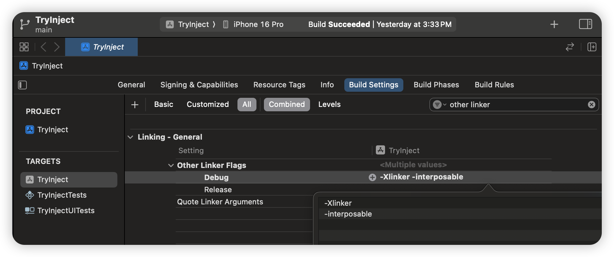

# InjectionIII.app Project

## 同时支持 Swift, Objective-C & C++ 的代码热重载工具！ 

[英文版本 README](https://github.com/johnno1962/InjectionIII/blob/main/README.md)


Injection 能够让你在 iOS 模拟器、真机、Arm 芯片 Mac 直接运行的 iOS app 上无需重新构建或者重启你的 app 就实现更新 class 的实现、方法，添加 struct 或者 enum。节省开发者大量调试代码和设计迭代的时间。它把 Xcode 的职责从“源代码编辑器”变成“程序编辑器”，源码的修改不再仅仅保存在磁盘中而是会直接注入到运行时的程序中
### 重要提示：Injection 与 Xcode 16.3

InjectionIII 的工作原理是将编辑过的源文件重新编译成动态库，然后加载到你的应用程序中。它通过搜索最近的 Xcode 构建日志中的 `swift-frontend` 编译器调用来确定如何重新编译文件。不幸的是，在这个功能正常工作了 10 年之后，Xcode 16.3 默认不再记录这些信息。但是，如果你使用 "Editor/Add Build Setting/Add User-Defined Setting" 为项目的 `Debug` 构建设置添加 `EMIT_FRONTEND_COMMAND_LINES` 值（设置为 "YES"），那么 InjectionIII 可以继续像以前一样工作。


### 如何使用

你可以在 [github
releases](https://github.com/johnno1962/InjectionIII/releases) 下载最新的 app 
也可以选择通过 [Mac App Store](https://itunes.apple.com/app/injectioniii/id1380446739?mt=12) 下载，然后你需要把下面这些代码添加到你的工程中并且在 app 启动时执行它（比如在 didFinishLaunchingWithOptions 的时候），这些配置工作就完成了。


```Swift
#if DEBUG
Bundle(path: "/Applications/InjectionIII.app/Contents/Resources/iOSInjection.bundle")?.load()
//for tvOS:
Bundle(path: "/Applications/InjectionIII.app/Contents/Resources/tvOSInjection.bundle")?.load()
//Or for macOS:
Bundle(path: "/Applications/InjectionIII.app/Contents/Resources/macOSInjection.bundle")?.load()
#endif
```
另外一个非常重要的事情是添加 `-Xlinker` and `-interposable` 这两个参数到 "Other Linker Flags" 你的工程文件中（注意只修改 `Debug` 配置如下图所示）



配置完成以后，当 app 运行起来以后控制台会输出一条关于文件监视器监听目录的消息，当前工程中包含的源文件保存的同时它也会同时被注入到您的设备中。所有旧的代码实现都会被替换为最新的代码实现

通常来说，你想要在屏幕中立刻看到最新的效果，可能需要让某些函数被重新调用一次。比如你在 view controller 中注入了代码，想要让它被重新渲染。你可以实现 `@objc func injected()` 方法，这个函数将会被框架自动调用。在项目中使用可以参考下面这个样例代码

```Swift
#if DEBUG
extension UIViewController {
    @objc func injected() {
        viewDidLoad()
    }
}
#endif
```
另外一个解法是用 "hosting"，使用的是
[Inject](https://github.com/krzysztofzablocki/Inject) 这个 Swift Package，用法参考[这篇博客](https://merowing.info/2022/04/hot-reloading-in-swift/).

### 哪些做不到的？

你不能修改数据在内存中的布局，比如你不能添加、删除、排序属性。对于非最终类（non-final classes），增加或删除方法也是不能工作的，因为用于分派的虚表（vtable）本身就是一种数据结构，不能靠 Injection 修改。Injection 也无法判断哪些代码段需要重新执行以更新显示，如上所述你需要自己判断。此外，不要过度使用访问控制。私有属性和方法不能直接被注入，特别是在扩展中，因为它们不是全局可替换的符号。它们通常通过间接方式进行注入，因为它们只能在被注入的文件内部访问，但这可能会引起混淆。最后，代码注入的同时又在对源文件执行添加、重命名或删除的操作可能会出问题。您可能需要重新构建并重新启动您的应用程序，甚至关闭并重新打开您的项目以清除旧的 Xcode 构建日志。

### Injection 在 SwiftUI 中的使用

如果说有什么区别的话，SwiftUI 比 UIKit 更适合注入，因为它有特定的机制来更新显示，但你需要对每个想要注入的 `View` 结构体做一些修改。为了强制重新绘制，最简单的方法是添加一个属性来观察注入何时发生：

```
    @ObserveInjection var forceRedraw
```
这个属性包装器可以在 [HotSwiftUI](https://github.com/johnno1962/HotSwiftUI) 或 [Inject](https://github.com/krzysztofzablocki/Inject) Swift 包（SMP）中找到。它实际上就是包含了一个 @Published 整数，视图可以观察这个整数，它会在每次注入时递增。您可以使用以下任一方法保证相关的代码在整个项目中可用：

```
@_exported import HotSwiftUI
or
@_exported import Inject
```

让 SwiftUI 注入所需的第二个更改是调用 View 的 `.enableInjection()` 方法将 body 属性的返回类型“擦除”为 `AnyView` ——这个技巧叫做"erase the return type"。这是因为，在添加或删除 SwiftUI 元素时，body 属性的具体返回类型可能会发生变化，这相当于内存布局的更改，可能会导致崩溃。总的来说，每个 body 的末尾都应该看起来像这样：

```
    var body: some View {
         VStack or whatever {
        // Your SwiftUI code...
        }
        .enableInjection()
    }

    @ObserveInjection var redraw
```
你可以保留这些修改到生产环境中，`Release` 构建时这个调用会被优化为一个无操作（no-op）

#### Xcode 16
Xcode 16 中新增了 SWIFT_ENABLE_OPAQUE_TYPE_ERASURE 构建设置。这个设置默认是开启的，你不再需要显式地擦除视图的 body。但是，你仍然需要使用 `@ObserveInjection` 来强制重新绘制。

更多的信息可以参考 [Xcode 16.2 release notes](https://developer.apple.com/documentation/xcode-release-notes/xcode-16_2-release-notes).

### 关于 Injection 在 iOS, tvOS or visionOS 设备上的运行
[github 
4.8.0+ releases](https://github.com/johnno1962/InjectionIII/releases) 版本以上的 InjectionIII.app 需要通过修改 user default 并且重启 mac 端的 InjectionIII.app 明确表示需要真机调试，在命令行执行下面代码可以修改 user default

```
$ defaults write com.johnholdsworth.InjectionIII deviceUnlock any
```

还需要在在“Build Phase” 添加一个 run script, 并且关闭 "User Script Sandboxing"

```
RESOURCES=/Applications/InjectionIII.app/Contents/Resources
if [ -f "$RESOURCES/copy_bundle.sh" ]; then
    "$RESOURCES/copy_bundle.sh"
fi
```
最后在 app 启动以后加载相关的 bundle，具体参考下面的示例代码

```
    #if DEBUG
    if let path = Bundle.main.path(forResource:
            "iOSInjection", ofType: "bundle") ??
        Bundle.main.path(forResource:
            "macOSInjection", ofType: "bundle") {
        Bundle(path: path)!.load()
    }
    #endif
```
这样配置以后，模拟器和真机就都可以工作了。有关如何通过 Wi-Fi 连接到 InjectionIII.app 进行调试的详细信息，请查阅 [HotReloading project](https://github.com/johnno1962/HotReloading) 项目 的 README。你还需要从下拉菜单中手动选择项目目录以供文件监视器使用。

### 在 macOS 上工作
macOS 也可以工作，但在开发过程中，你需要暂时关闭 "app sandbox" 和 "hardened runtime-library validation" ，以便能够动态加载代码。为了避免代码签名问题，请按照上述在真实设备上进行注入的说明，使用新的 `copy_bundle.sh` 脚本。

### 工作原理

Injection 这个项目这么多年来尝试了各种各样的方式来实现，最开始使用的是 Objective-C 的 "Swizzling" API，现在则选择苹果链接器的一个特性—— "interposing" 来实现，它让 Swift （动态注入）方法或计算属性成为可能。

当你的代码在Swift中调用一个函数时，它通常是“statically
dispatched”（静态分派）的，即通过被调用函数的“mangled symbol”（混淆符号）进行链接。然而，当你使用“-interposable”选项链接应用程序时，会添加一个额外的间接层，它通过一段可写的内存区域找到所有被调用函数的地址。利用操作系统层面提供的加载可执行代码的能力以及 [fishhook](https://github.com/facebook/fishhook) 库来“rebind”（重新绑定）函数调用，因此可以“interpose”（插入）任何函数的新实现，并在运行时有效地将它们缝合到你的程序的其余部分。从这一点开始，它将表现得就像新代码已经被构建进了程序中。

Injection 使用 `FSEventSteam` API 来监视源文件何时发生变化，并扫描最后一次 Xcode build log（构建日志）得到如何重新编译它，并链接一个可以加载到你的程序中的动态库的信息。然后，运行时支持会加载这个动态库，并扫描它包含的函数定义，并将它们“interposes”（插入）到程序的其余部分。此外，因为 “non-final” （没有被声明为 final 的）类方法的分派使用了一个“vtable”（虚表，类似于C++中的虚拟方法），这也需要更新，这个项目也已经把这个问题处理好了，当然也包括以及任何遗留的 Objective-C “Swizzling”。

如果您对 Injection 的工作原理感兴趣，最好的信息来源是我的书《[Swift Secrets](http://books.apple.com/us/book/id1551005489)》或者直接阅读 [InjectionLite](https://github.com/johnno1962/InjectionLite) Swift 包（SMP）中的源码。关于“interposing”的更多信息，可以参考这篇博客文章 [Dyld Dynamic Linking on OS X](https://www.mikeash.com/pyblog/friday-qa-2012-11-09-dyld-dynamic-linking-on-os-x.html) 或者 [fishhook](https://github.com/facebook/fishhook) 项目的 README。关于应用程序本身的组织结构，可以参考[ROADMAP.md](https://github.com/johnno1962/InjectionIII/blob/main/ROADMAP.md)文件。

### 关于术语的说明

Injection 工作有三个组成部分，这三者协同工作让整个项目能够工作
1. FileWatcher：文件监视器，检测代码文件变动情况
1. 动态库生成：将更改的代码文件重新编译成动态库
1. Injection 代码本身：负责在应用程序运行时将最新代码缝合到应用中

"Injection classic" 是最经典的使用方式。先运行从 GitHub 下载的 [二进制发行版](https://github.com/johnno1962/InjectionIII/releases) 中包含的 InjectionIII.app。然后在模拟器运行你的项目时，使用 NSBundle 的 load 方法加载 `/Applications/InjectionIII.app/Contents/Resources/iOSInjection.bundle` 到你的程序中。在这种使用方式下，文件监视和源代码重新编译是在 mac 端 app 内部完成的，接着模拟器中的 bundle 通过套接字(socket)与 mac 连接来得知何时有新的动态库准备加载。

"App Store injection" 是指在 Appstore 下载 injection.app，这种版本的应用是沙盒化的，虽然文件监视器仍然在应用内部运行，但是重新编译和加载的工作被委托到模拟器内部执行。这种方式有些 C 语言的头文件会产生一些错误，这是由于模拟器使用大小写敏感的文件系统——这模拟了真实设备的文件系统。

"HotReloading injection" 可以让你在真实设备（你的 iPhone 或者 iPad）上使用本项目。因为手机访问不到 Mac 文件系统的 bundle 文件，因此你可以将 [HotReloading Swift Package](https://github.com/johnno1962/HotReloading) 添加到你的项目中（仅在开发期间！），HotReloading 里的 bundle 包含本项目执行动态加载的所有代码。你必须把使用未沙盒化（un-sandboxed）的二进制发行版。上面曾经提及的 `copy_bundle.sh` 脚本也不用再添加到 `Build Phase` 中了

“独立式版本 Injection”（Standalone injection）是本项目的最新演变，在模拟器运行时使用时会更加便捷。这种方式下 mac 端的 Injection.app 不需要再运行了，简单地加载其中一个 bundle，文件监视、重新编译和注入都在模拟器内部完成。默认情况下，这会监视你主目录下任何 Swift 文件的更改，不过你可以使用环境变量`INJECTION_DIRECTORIES`来更改这个设置。

[InjectionLite](https://github.com/johnno1962/InjectionLite) 是一个只包含了注入相关的核心代码，代码量相对较少。只需添加这个 Swift 包，你应该就能够在模拟器中进行注入，你可以通过这个项目学习到 Injection 的工作原理。

[InjectionNext](https://github.com/johnno1962/InjectionNext) 是 Injection 的一个目前正在实验的版本，它致力于为大型项目提供更快、更可靠的性能。它集成到 Xcode 的调试标志（debugging flag）中，以了解如何重新编译文件，从而避免了解析构建日志（build logs），客户端的实现代码直接复用的是 `InjectionLite` 项目里的代码。为了让诸如 `Cursor` 等外部编辑器也可以工作，InjectionNext 也同样支持文件监视器来检测编辑，这时候工作方式将回退到通过构建日志（build log）来解析代码。


所有这些变体版本都需要你在 Debug 构建选项 "Other Linker Flags" 中添加 "-Xlinker -interposable" 链接器标志，否则你将只能为非final类的注入方法。除此之外，还有一些更高层次的封装项目 [Inject](https://github.com/krzysztofzablocki/Inject) 和 
[HotSwiftUI](https://github.com/johnno1962/HotSwiftUI) ，都可以和本项目结合起来一起使用。

### 更多信息

请阅读旧的[old README](https://github.com/johnno1962/InjectionIII/blob/main/OLDME.md) 文件，以获取更多你想要需要了解的信息，包括你可以用于自定义的各种环境变量。以下是一些例子：

| 环境变量（Environment var） | 目的（Purpose）|
| ------------- | ------------- |
| **INJECTION_DETAIL** | 更详细的日志输出 |
| **INJECTION_TRACE** | 注入方法被执行的信息 (4.6.6+ 以后的版本才能支持) |
| **INJECTION_HOST** | 真机注入时填写 Mac 端 IP address |

通过设置一个 **INJECTION_TRACE** 环境变量，注入任何文件都会添加对该文件中所有函数和方法的调用日志，以及它们的参数值，以帮助调试。

InjectionIII 另一个鲜为人知的特性是，只要你的测试用例执行过一次，你就可以注入一个单独的 XCTest 类，并立即运行它——每次你修改它时，都会报告它是否失败。

### 致谢:

本项目包含的代码包括 [rentzsch/mach_inject](https://github.com/rentzsch/mach_inject),
[erwanb/MachInjectSample](https://github.com/erwanb/MachInjectSample),
[davedelong/DDHotKey](https://github.com/davedelong/DDHotKey) and
[acj/TimeLapseBuilder-Swift](https://github.com/acj/TimeLapseBuilder-Swift) 并且遵循了相关许可

App Tracing 工作的原理是使用了 [OliverLetterer/imp_implementationForwardingToSelector](https://github.com/OliverLetterer/imp_implementationForwardingToSelector) 提供的 trampoline 实现并通过一个遵循了 MIT 许可证的 [SwiftTrace](https://github.com/johnno1962/SwiftTrace) 项目来实现的

SwiftTrace 使用了非常方便的 [https://github.com/facebook/fishhook](https://github.com/facebook/fishhook)。
本项目具体遵循的许可证（licensing）在 app bundle 中源码头文件中都有具体的说明

这个版本包含了一个经过轻微修改的优秀[canviz](https://code.google.com/p/canviz/) 库，用于在 HTML 画布上渲染 “dot” 文件，该库遵循 MIT 许可证。所做的修改包括：将节点的ID传递给节点标签标签（第 212 行），反转节点的渲染以及连接它们的线的渲染（第 406 行），以及存储边路径以便它们可以被着色（第 66 行和第 303 行）在“canviz-0.1/canviz.js”中。

同时还包括了[CodeMirror](http://codemirror.net/)，这是一个 JavaScript 编辑器
用于在 MIT 许可证下评估将要通过注入执行的代码。

这个出色的应用程序图标要感谢 Katya 提供的[pixel-mixer.com](http://pixel-mixer.com/)的


$Date: 2025/05/12 $
